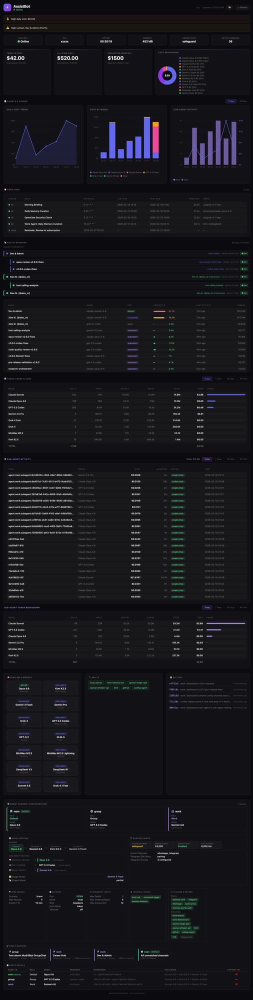

# OpenClaw Dashboard

A beautiful, zero-dependency command center for [OpenClaw](https://github.com/openclaw/openclaw) AI agents.


## Why This Exists

When you run OpenClaw seriously — multiple agents, dozens of cron jobs, sub-agents spawning sub-agents, several Telegram groups and Whatsapp, Slack, and Discord channels, 10+ models, multiple agents and sub-agents — information gets scattered fast.

**The problem:** there was no single place to answer the obvious questions:
- Is my gateway actually running right now?
- How much have I spent today, and which model is burning the most?
- Which cron jobs ran, which failed, and when does the next one fire?
- What sessions are active and how much context are they consuming?
- Are my sub-agents doing useful work or spinning in circles?
- What's the cost trend over the last 7 days — am I accelerating?

The only way to answer these was digging through log files, running CLI commands, and mentally stitching together a picture from 5 different sources. That friction adds up.

**The solution:** a single local page that collects everything in one place — gateway health, costs, cron status, active sessions, sub-agent runs, model usage, git log — refreshed automatically, no login, no cloud, no external dependencies. Open a browser tab, get the full picture in seconds.

It's not trying to replace the OpenClaw CLI or Telegram interface. It's the at-a-glance overview layer that tells you whether everything is healthy and where your money and compute are going — so you can make decisions without hunting for data.

## Features

### 11 Dashboard Panels

1. **🔔 Header Bar** — Bot name, online/offline status, auto-refresh countdown, theme picker
2. **⚠️ Alerts Banner** — Smart alerts for high costs, failed crons, high context usage, gateway offline
3. **💚 System Health** — Gateway status, PID, uptime, memory, compaction mode, active session count
4. **💰 Cost Cards** — Today's cost, all-time cost, projected monthly, cost breakdown donut chart
5. **⏰ Cron Jobs** — All scheduled jobs with status, schedule, last/next run, duration, model
6. **📡 Active Sessions** — Recent sessions with model, type badges (DM/group/cron/subagent), context %, tokens
7. **📊 Token Usage & Cost** — Per-model breakdown with 7d/30d/all-time tabs, usage bars, totals
8. **🤖 Sub-Agent Activity** — Sub-agent runs with cost, duration, status + token breakdown (7d/30d tabs)
9. **📈 Charts & Trends** — Cost trend line, model cost breakdown bars, sub-agent activity — all pure SVG, 7d/30d toggle
10. **🧩 Bottom Row** — Available models grid, skills list, git log
11. **💬 AI Chat** — Ask questions about your dashboard in natural language, powered by your OpenClaw gateway

### Key Features

- 🔄 **On-Demand Refresh** — `server.py` refreshes data when you open the dashboard (no stale data)
- ⏱️ **Auto-Refresh** — Page auto-refreshes every 60 seconds with countdown timer
- 🎨 **6 Built-in Themes** — 3 dark (Midnight, Nord, Catppuccin Mocha) + 3 light (GitHub, Solarized, Catppuccin Latte), switchable from the UI
- 🖌️ **Glass Morphism UI** — Subtle transparency and hover effects
- 📱 **Responsive** — Adapts to desktop, tablet, and mobile
- 🔒 **Local Only** — Runs on localhost, no external dependencies
- 🐧 **Cross-Platform** — macOS and Linux
- ⚡ **Zero Dependencies** — Pure HTML/CSS/JS frontend, Python stdlib backend
- 💬 **AI Chat** — Natural language queries about costs, sessions, crons, and config via OpenClaw gateway

## Quick Start

### One-Line Install

```bash
curl -fsSL https://raw.githubusercontent.com/mudrii/openclaw-dashboard/main/install.sh | bash
```

This will:
1. Install to `~/.openclaw/dashboard`
2. Create a default config
3. Run initial data refresh
4. Start `server.py` as a system service
5. Open http://127.0.0.1:8080

### Manual Install

```bash
# Clone the repo
git clone https://github.com/mudrii/openclaw-dashboard.git ~/.openclaw/dashboard
cd ~/.openclaw/dashboard

# Create your config
cp examples/config.minimal.json config.json
nano config.json  # Set your bot name

# Start the server (refreshes data on-demand)
python3 server.py &

# Or bind to LAN for access from other devices
python3 server.py --bind 0.0.0.0 &

# Open in browser
open http://127.0.0.1:8080  # macOS
xdg-open http://127.0.0.1:8080  # Linux
```

## Themes

Click the 🎨 button in the header to switch themes instantly — no reload or server restart needed. Choice persists via `localStorage`.

| Theme | Type | Vibe |
|-------|------|------|
| 🌙 **Midnight** | Dark | Original glass morphism (default) |
| 🏔️ **Nord** | Dark | Arctic blue, calm, great for long sessions |
| 🌸 **Catppuccin Mocha** | Dark | Warm pastels, easy on eyes |
| ☀️ **GitHub Light** | Light | Clean, professional, high readability |
| 🌅 **Solarized Light** | Light | Scientifically optimized contrast |
| 🌻 **Catppuccin Latte** | Light | Soft pastels |

### Custom Themes

Add your own themes by editing `themes.json`. Each theme defines 19 CSS color variables:

```json
{
  "my-theme": {
    "name": "My Theme",
    "type": "dark",
    "icon": "🎯",
    "colors": {
      "bg": "#1a1a2e",
      "surface": "rgba(255,255,255,0.03)",
      "surfaceHover": "rgba(255,255,255,0.045)",
      "border": "rgba(255,255,255,0.06)",
      "accent": "#e94560",
      "accent2": "#0f3460",
      "green": "#4ade80",
      "yellow": "#facc15",
      "red": "#f87171",
      "orange": "#fb923c",
      "purple": "#a78bfa",
      "text": "#e5e5e5",
      "textStrong": "#ffffff",
      "muted": "#737373",
      "dim": "#525252",
      "darker": "#404040",
      "tableBg": "rgba(255,255,255,0.025)",
      "tableHover": "rgba(255,255,255,0.05)",
      "scrollThumb": "rgba(255,255,255,0.1)"
    }
  }
}
```

## Architecture

```
server.py          ← HTTP server + /api/refresh + /api/chat endpoints
  ├── index.html   ← Single-page dashboard (fetches /api/refresh, /api/chat)
  ├── themes.json  ← Theme definitions (user-editable)
  ├── refresh.sh   ← Data collection script (called by server.py)
  └── data.json    ← Generated data (auto-refreshed)
```

When you open the dashboard, `index.html` calls `/api/refresh`. The server runs `refresh.sh` (with 30s debounce) to collect fresh data from your OpenClaw installation, then returns the JSON. No cron jobs needed.

The `/api/chat` endpoint accepts `{"question": "...", "history": [...]}` and forwards a stateless request to the OpenClaw gateway's OpenAI-compatible `/v1/chat/completions` endpoint, with a system prompt built from live `data.json`.

## Configuration

Edit `config.json`:

```json
{
  "bot": {
    "name": "My Bot",
    "emoji": "🤖"
  },
  "theme": {
    "preset": "nord"
  },
  "refresh": {
    "intervalSeconds": 30
  },
  "server": {
    "port": 8080,
    "host": "127.0.0.1"
  }
}
```

### Configuration Options

| Key | Default | Description |
|-----|---------|-------------|
| `bot.name` | `"OpenClaw Dashboard"` | Dashboard title |
| `bot.emoji` | `"🦞"` | Avatar emoji |
| `theme.preset` | `"midnight"` | Default theme (`midnight`, `nord`, `catppuccin-mocha`, `github-light`, `solarized-light`, `catppuccin-latte`) |
| `panels.*` | `true` | Show/hide individual panels (`panels.kanban` is legacy/no-op) |
| `refresh.intervalSeconds` | `30` | Debounce interval for refresh |
| `alerts.dailyCostHigh` | `50` | Daily cost threshold for high alert ($) |
| `alerts.dailyCostWarn` | `20` | Daily cost threshold for warning alert ($) |
| `alerts.contextPct` | `80` | Context usage % threshold for alerts |
| `alerts.memoryMb` | `640` | Gateway memory threshold (MB) for alerts |
| `server.port` | `8080` | Server port (also `--port` / `-p` flag or `DASHBOARD_PORT` env) |
| `server.host` | `"127.0.0.1"` | Server bind address (also `--bind` / `-b` flag or `DASHBOARD_BIND` env) |
| `openclawPath` | `"~/.openclaw"` | Legacy key; runtime path is currently controlled by `OPENCLAW_HOME` env var |
| `ai.enabled` | `true` | Enable/disable the AI chat panel and `/api/chat` endpoint |
| `ai.gatewayPort` | `18789` | Port of your OpenClaw gateway |
| `ai.model` | `"kimi-coding/k2p5"` | Model to use for chat (any model registered in your gateway) |
| `ai.maxHistory` | `6` | Number of previous messages to include for context |
| `ai.dotenvPath` | `"~/.openclaw/.env"` | Path to `.env` file containing `OPENCLAW_GATEWAY_TOKEN` |

### AI Chat Setup

The chat panel requires:

1. Your OpenClaw gateway running with the `chatCompletions` endpoint enabled:
   ```json
   "gateway": {
     "http": { "endpoints": { "chatCompletions": { "enabled": true } } }
   }
   ```
2. `OPENCLAW_GATEWAY_TOKEN` set in your `.env` file (defaults to `~/.openclaw/.env`)

The chat is stateless — each question is sent directly to the gateway with a system prompt built from live `data.json`. No agent memory or tools bleed in.

See [docs/CONFIGURATION.md](docs/CONFIGURATION.md) for full details.

## Screenshots

Full dashboard view — all sections at a glance:



---

### 🔔 Overview & System Health
Real-time bot status, gateway uptime, memory usage, active session count, today's cost, all-time spend, projected monthly cost, and a per-model cost breakdown donut chart. Smart alert banners surface high costs, failed crons, and context overflows automatically.


---

### 📈 Charts & Trends
Three always-visible SVG charts with 7d/30d toggle: cost trend over time, per-model cost breakdown bars, and sub-agent activity volume. No external chart libraries — pure inline SVG.


---

### ⏰ Cron Jobs
All scheduled jobs with status badges (active/idle/error), schedule expression, last run time, next run, duration, and the model used. At-a-glance view of your automation health.


---

### 📡 Active Sessions + Agent Hierarchy Tree
Live sessions with model, type badges (DM / group / subagent), context usage %, and token count. Above the session list: a visual agent hierarchy tree showing parent → sub-agent → sub-sub-agent relationships with live/idle status and trigger labels — updated every refresh.


---

### 📊 Token Usage & Cost
Per-model token and cost breakdown with 7d / 30d / all-time tabs. Includes input tokens, output tokens, cache reads, and total cost per model — sortable at a glance.


---

### 🤖 Sub-Agent Activity
All sub-agent runs with cost, duration, status, and token breakdown. Separate 7d/30d tabs. Useful for tracking which tasks spawn the most agents and where spend is concentrated.


---

### 🧩 Available Models, Skills & Git Log
Quick reference panel showing all configured models, active skills, and the last 5 git commits from your OpenClaw workspace — so you always know what's deployed.


---

### ⚙️ Agent & Model Configuration
Full agent setup at a glance: model routing chain (primary → fallbacks), sub-agent routing by purpose (General / Dev+Coding / Work), agent details table with per-agent fallbacks, agent bindings with resolved group names, runtime config (compaction, memory flush), and subagent limits (max depth, max children/agent).


## Uninstall

```bash
./uninstall.sh
```

Or manually:
```bash
# macOS
launchctl unload ~/Library/LaunchAgents/com.openclaw.dashboard.plist
rm -rf ~/.openclaw/dashboard

# Linux
systemctl --user stop openclaw-dashboard
rm -rf ~/.openclaw/dashboard
```

## Requirements

- **Python 3.6+** — Backend server and data collection
- **OpenClaw** — Installed at `~/.openclaw` ([docs](https://docs.openclaw.ai))
- **macOS** 10.15+ or **Linux** (Ubuntu 18.04+, Debian 10+)
- Modern web browser

## Changelog

### v2026.2.23 — AI Chat Integration

- **New**: AI chat panel (💬 FAB) — ask natural language questions about costs, sessions, crons, and config
- **New**: `/api/chat` endpoint backed by the OpenClaw gateway's OpenAI-compatible completions API
- **New**: `read_dotenv()` loads `OPENCLAW_GATEWAY_TOKEN` from `~/.openclaw/.env` automatically
- **New**: `build_dashboard_prompt()` compresses live `data.json` into a structured system prompt
- **New**: `ai` config section — `enabled`, `gatewayPort`, `model`, `maxHistory`, `dotenvPath`
- **Improved**: Stateless gateway calls — no agent memory or tool bleed between sessions
- **Fixed**: 60s gateway timeout (up from 30s) to accommodate reasoning model latency
- **Tests**: 14 new tests, 62/62 passing (AC-CHAT-1 through AC-CHAT-8)
- **Version**: `2.3.0` → `2.4.0`

### v2026.2.21

- **Fixed**: `refresh.sh` now correctly handles agents with dictionary-style `model` configs (containing `primary` and `fallbacks` keys). Previously, dict-type model configs caused TypeError and prevented those agents from appearing in the dashboard. (Fixes #2)

### v2026.2.20

- **New**: Dynamic channels panel renders all configured/runtime channels (Slack, Discord, Telegram, WhatsApp, and unknown future channels)
- **Improved**: Connected/Health now show explicit `Unknown` fallback when runtime signal is absent
- **New**: Runtime channel-status backfill from recent session activity (marks active channels as connected/health=active when explicit status is missing)
- **New**: Agent Bindings includes inferred **IMPLICIT** routes for channels without explicit binding entries
- **Quality**: Generic single-agent and multi-agent compatibility validated
- **Security**: XSS-safe escaping preserved for all dynamic channel/binding values
- **Tests**: 46/46 passing, independently validated with Opus

### v2026.2.19

- **New**: Section dirty-checking — `prevD` snapshot + `sectionChanged()` skips unchanged DOM sections on every refresh
- **New**: `requestAnimationFrame` batching for render calls
- **New**: Scroll position preservation for cron and session tables
- **Fixed**: Tab switching (7d/30d/today) correctly triggers re-render after dirty-check introduction
- **Fixed**: Cross-tab dirty-check contamination between token usage and sub-token sections
- **Fixed**: Invalid `chartDays` key in `sectionChanged()`, `t.colors` null guard in theme menu
- **New**: Full ATDD test suite — 44 acceptance criteria across 4 test files
- **New**: `ARCHITECTURE.md` — clean module design for future refactor
- **New**: `TODO.md` — backlog with version plan
- **New**: GitHub link + version badge in header
- **New**: "Why This Exists" section in README

### v2026.2.18

- **New**: 🌳 Agent Hierarchy Tree in Active Sessions — 3-level CSS indented cards showing parent→child agent relationships
- **New**: Sub-agent Routing section in Model Routing panel
- **Improved**: Agent Bindings redesign — resolved group names + main agent catch-all display
- **New**: Fallbacks column in Agent Details table
- **New**: Subagent Limits panel
- **Improved**: Font size consistency fixes across Agent Config section
- **Improved**: Runtime Config channel rows compact layout

### v2026.2.17

- **New**: 📈 Charts & Trends section — 3 always-visible pure SVG charts (cost trend, model breakdown, sub-agent activity)
- **New**: 7d/30d time filter tabs on Token Usage, Sub-Agent Activity, and Sub-Agent Token Breakdown panels
- **New**: Charts have their own 7d/30d toggle, default to 7 days
- **New**: Daily aggregation in `refresh.sh` — 30 days of `dailyChart` data with per-model cost breakdown
- **New**: `models_7d`, `models_30d`, `subagent_7d`, `subagent_30d` data buckets
- **Improved**: `refresh.sh` now collects 35 data keys for richer time-series analysis

### v2026.2.16

- **New**: 🎨 Multi-theme support — 6 built-in themes (3 dark + 3 light)
- **New**: Theme switcher in header bar — instant CSS variable swap, no reload needed
- **New**: `themes.json` — external theme definitions, user-editable for custom themes
- **New**: Themes persist via `localStorage` across page refreshes
- **New**: `TECHNICAL.md` — comprehensive developer documentation (architecture, data pipeline, schema, security)
- **Improved**: Replaced ~20 hardcoded color values with CSS custom properties for full theme support

### v2026.2.15

- **New**: `--bind` / `-b` flag for LAN access (`--bind 0.0.0.0`)
- **New**: `--port` / `-p` flag for custom port
- **New**: `--version` / `-V` flag
- **New**: `DASHBOARD_BIND` and `DASHBOARD_PORT` environment variables
- **New**: `config.json` support for `server.host` and `server.port` settings
- **New**: `refresh.intervalSeconds` config option for debounce tuning
- **New**: Auto-detect and display LAN IP when binding to `0.0.0.0`
- **Improved**: Config priority chain: CLI flags > env vars > config.json > defaults
- **Improved**: `--help` with usage examples

### v2026.2.8

- **New**: Complete UI redesign with glass morphism dark theme
- **New**: `server.py` with on-demand `/api/refresh` endpoint (replaces `python3 -m http.server`)
- **New**: 10 dashboard panels (up from 4)
- **New**: Sub-agent activity tracking with cost and token breakdown
- **New**: Smart alerts system (cost warnings, failed crons, high context, gateway offline)
- **New**: System health row (gateway, PID, uptime, memory, compaction, sessions)
- **New**: Cost donut chart with per-model breakdown
- **New**: Kanban board for task tracking
- **New**: Active sessions panel with context % bars and type badges
- **New**: Git log panel
- **New**: Auto-refresh with 60s countdown
- **Improved**: Token usage tables with today/all-time toggle
- **Improved**: `refresh.sh` auto-discovers all sessions, crons, models, skills
- **Improved**: Responsive layout for mobile/tablet

### v2026.2.6

- Initial release with basic token usage and cron panels

## Contributing

See [CONTRIBUTING.md](CONTRIBUTING.md) for guidelines.

## License

MIT License — see [LICENSE](LICENSE)

---

Made with 🦞 for the [OpenClaw](https://github.com/openclaw/openclaw) community
