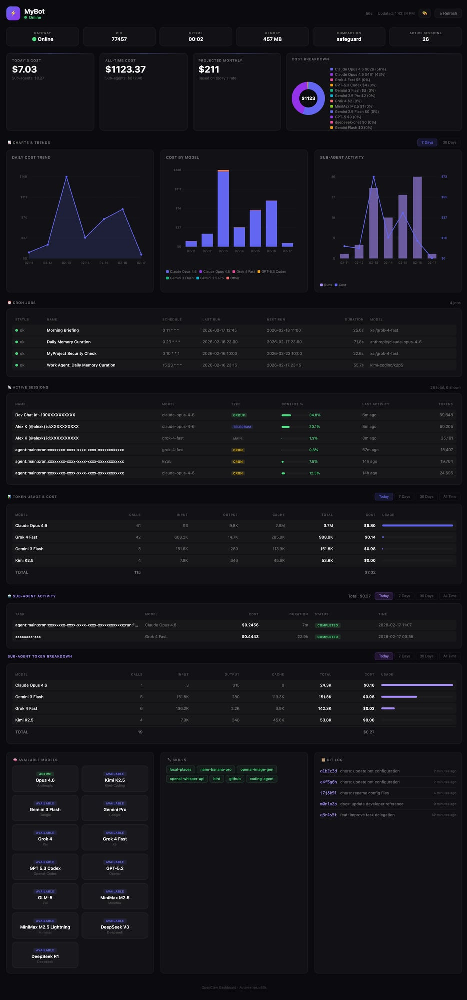

# OpenClaw Dashboard

A beautiful, zero-dependency command center for [OpenClaw](https://github.com/openclaw/openclaw) AI agents.



## Features

### 9 Dashboard Panels

1. **🔔 Header Bar** — Bot name, online/offline status, auto-refresh countdown
2. **⚠️ Alerts Banner** — Smart alerts for high costs, failed crons, high context usage, gateway offline
3. **💚 System Health** — Gateway status, PID, uptime, memory, compaction mode, active session count
4. **💰 Cost Cards** — Today's cost, all-time cost, projected monthly, cost breakdown donut chart
5. **⏰ Cron Jobs** — All scheduled jobs with status, schedule, last/next run, duration, model
6. **📡 Active Sessions** — Recent sessions with model, type badges (DM/group/cron/subagent), context %, tokens
7. **📊 Token Usage & Cost** — Per-model breakdown with today/all-time toggle, usage bars, totals
8. **🤖 Sub-Agent Activity** — Sub-agent runs with cost, duration, status + token breakdown
9. **🧩 Bottom Row** — Available models grid, skills list, git log

### Key Features

- 🔄 **On-Demand Refresh** — `server.py` refreshes data when you open the dashboard (no stale data)
- ⏱️ **Auto-Refresh** — Page auto-refreshes every 60 seconds with countdown timer
- 🎨 **Glass Morphism UI** — Dark theme with subtle transparency and hover effects
- 📱 **Responsive** — Adapts to desktop, tablet, and mobile
- 🔒 **Local Only** — Runs on localhost, no external dependencies
- 🐧 **Cross-Platform** — macOS and Linux
- ⚡ **Zero Dependencies** — Pure HTML/CSS/JS frontend, Python stdlib backend

## Quick Start

### One-Line Install

```bash
curl -fsSL https://raw.githubusercontent.com/mudrii/openclaw-dashboard/main/install.sh | bash
```

This will:
1. Install to `~/.openclaw/dashboard`
2. Create a default config
3. Run initial data refresh
4. Start `server.py` as a system service
5. Open http://127.0.0.1:8080

### Manual Install

```bash
# Clone the repo
git clone https://github.com/mudrii/openclaw-dashboard.git ~/.openclaw/dashboard
cd ~/.openclaw/dashboard

# Create your config
cp examples/config.minimal.json config.json
nano config.json  # Set your bot name

# Start the server (refreshes data on-demand)
python3 server.py &

# Or bind to LAN for access from other devices
python3 server.py --bind 0.0.0.0 &

# Open in browser
open http://127.0.0.1:8080  # macOS
xdg-open http://127.0.0.1:8080  # Linux
```

## Architecture

```
server.py          ← HTTP server + /api/refresh endpoint
  ├── index.html   ← Single-page dashboard (fetches /api/refresh)
  ├── refresh.sh   ← Data collection script (called by server.py)
  └── data.json    ← Generated data (auto-refreshed)
```

When you open the dashboard, `index.html` calls `/api/refresh`. The server runs `refresh.sh` (with 30s debounce) to collect fresh data from your OpenClaw installation, then returns the JSON. No cron jobs needed.

## Configuration

Edit `config.json`:

```json
{
  "bot": {
    "name": "My Bot",
    "emoji": "🤖"
  },
  "theme": {
    "accent": "#22c55e"
  },
  "panels": {
    "kanban": false
  },
  "server": {
    "port": 8080,
    "host": "127.0.0.1"
  },
  "openclawPath": "~/.openclaw"
}
```

### Configuration Options

| Key | Default | Description |
|-----|---------|-------------|
| `bot.name` | `"OpenClaw Dashboard"` | Dashboard title |
| `bot.emoji` | `"🦞"` | Avatar emoji |
| `theme.preset` | `"dark"` | Theme preset |
| `theme.accent` | `"#6366f1"` | Primary accent color |
| `panels.*` | `true` | Show/hide individual panels |
| `refresh.intervalSeconds` | `30` | Debounce interval for refresh |
| `alerts.dailyCostHigh` | `50` | Daily cost threshold for high alert ($) |
| `alerts.dailyCostWarn` | `20` | Daily cost threshold for warning alert ($) |
| `alerts.contextPct` | `80` | Context usage % threshold for alerts |
| `alerts.memoryMb` | `500` | Gateway memory threshold (MB) for alerts |
| `server.port` | `8080` | Server port (also `--port` / `-p` flag or `DASHBOARD_PORT` env) |
| `server.host` | `"127.0.0.1"` | Server bind address (also `--bind` / `-b` flag or `DASHBOARD_BIND` env) |
| `openclawPath` | `"~/.openclaw"` | Path to OpenClaw installation |

See [docs/CONFIGURATION.md](docs/CONFIGURATION.md) for full details.

## Screenshots

> Screenshots coming soon. The dashboard features a dark glass-morphism UI with:
> - Gradient header with live status indicator
> - Cost cards with animated donut chart
> - Sortable tables with usage bars
> - Responsive grid layout

## Uninstall

```bash
./uninstall.sh
```

Or manually:
```bash
# macOS
launchctl unload ~/Library/LaunchAgents/com.openclaw.dashboard.plist
rm -rf ~/.openclaw/dashboard

# Linux
systemctl --user stop openclaw-dashboard
rm -rf ~/.openclaw/dashboard
```

## Requirements

- **Python 3.6+** — Backend server and data collection
- **OpenClaw** — Installed at `~/.openclaw` ([docs](https://docs.openclaw.ai))
- **macOS** 10.15+ or **Linux** (Ubuntu 18.04+, Debian 10+)
- Modern web browser

## Changelog

### v2.3.0

- **New**: `--bind` / `-b` flag for LAN access (`--bind 0.0.0.0`)
- **New**: `--port` / `-p` flag for custom port
- **New**: `--version` / `-V` flag
- **New**: `DASHBOARD_BIND` and `DASHBOARD_PORT` environment variables
- **New**: `config.json` support for `server.host` and `server.port` settings
- **New**: `refresh.intervalSeconds` config option for debounce tuning
- **New**: Auto-detect and display LAN IP when binding to `0.0.0.0`
- **Improved**: Config priority chain: CLI flags > env vars > config.json > defaults
- **Improved**: `--help` with usage examples

### v2.0.0

- **New**: Complete UI redesign with glass morphism dark theme
- **New**: `server.py` with on-demand `/api/refresh` endpoint (replaces `python3 -m http.server`)
- **New**: 10 dashboard panels (up from 4)
- **New**: Sub-agent activity tracking with cost and token breakdown
- **New**: Smart alerts system (cost warnings, failed crons, high context, gateway offline)
- **New**: System health row (gateway, PID, uptime, memory, compaction, sessions)
- **New**: Cost donut chart with per-model breakdown
- **New**: Kanban board for task tracking
- **New**: Active sessions panel with context % bars and type badges
- **New**: Git log panel
- **New**: Auto-refresh with 60s countdown
- **Improved**: Token usage tables with today/all-time toggle
- **Improved**: `refresh.sh` auto-discovers all sessions, crons, models, skills
- **Improved**: Responsive layout for mobile/tablet

### v1.0.0

- Initial release with basic token usage and cron panels

## Contributing

See [CONTRIBUTING.md](CONTRIBUTING.md) for guidelines.

## License

MIT License — see [LICENSE](LICENSE)

---

Made with 🦞 for the [OpenClaw](https://github.com/openclaw/openclaw) community
