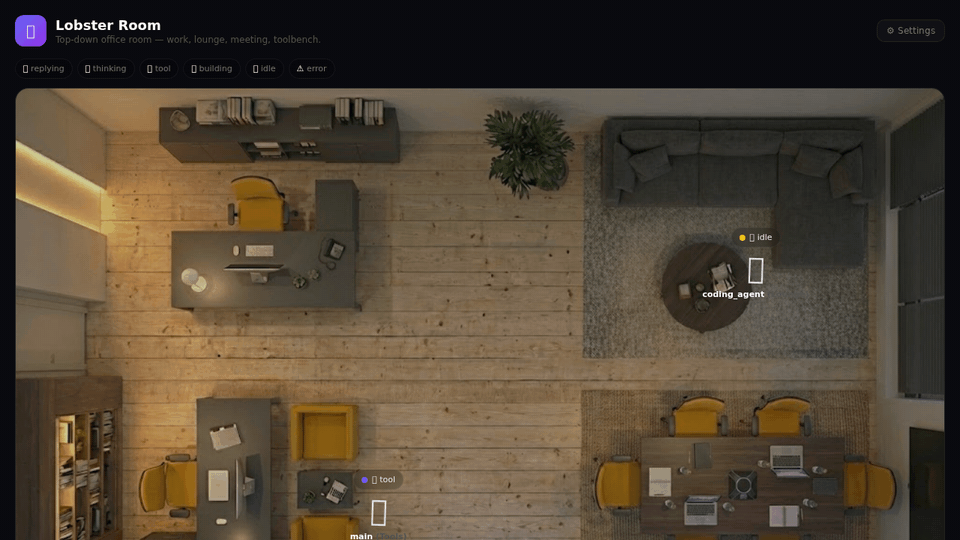

# Lobster Room 🦞

A cute, practical OpenClaw room dashboard that visualizes your **agents, sessions, and active work** as lobsters in a bird’s-eye room view — with a docked task feed, consistent resident identity, and room-aware movement.

> Served as an **OpenClaw Gateway plugin** at: `https://<openclaw-host>/lobster-room/`



## What's New in v0.3.0

- **Bundled starter rooms**: ship with multiple built-in room backgrounds + walk maps so first-run looks polished immediately
- **Canonical agent identity**: feed rows, resident avatars, and the Now panel resolve to the same visible agent instead of leaking child/internal ids
- **Room consistency fixes**: switching rooms, rehydration, and default-room reset now stay visually and logically in sync
- **Cleaner Settings IA**: Settings is reorganized into **Room Setup**, **Appearance**, and **History & Agents** for faster editing
- **Stronger feed UX**: humanized task wording, better parent/child attribution, and fewer duplicate / unknown agent rows

**Links**
- Portal: `https://<openclaw-host>/lobster-room/`
- API: `https://<openclaw-host>/lobster-room/api/lobster-room`

## Install / Update

### Install modes (recommended order)

- **Pinned release (recommended):** `VERSION=vX.Y.Z`
- **Latest release (default):** no env vars
- **Latest branch tip (dev/staging/hotfix):** `BRANCH=main` (or any branch)

> ⚠️ **Security note:** installing from a branch tip is higher supply-chain risk than a pinned release tag.

### Option A (recommended): Install via “OpenClaw prompt”

Copy/paste this into your OpenClaw agent:

> Please install (or update) the `zacmoltbot/lobster-room` OpenClaw Gateway plugin for me.
>
> Do the following and tell me what you changed:
> 1) Install the plugin by running: `bash -c "$(curl -fsSL https://raw.githubusercontent.com/zacmoltbot/lobster-room/main/plugin/lobster-room/install.sh)"`.
> 2) Ensure `~/.openclaw/openclaw.json` enables plugin id `lobster-room`.
> 3) Restart the OpenClaw Gateway (if you cannot restart it, tell me exactly what I should restart).
> 4) Verify `https://<openclaw-host>/lobster-room/`.
>
> Optional: if I ask for a pinned install, use `VERSION=vX.Y.Z` when running the installer.
> Optional: if I ask for a branch tip, use `BRANCH=main` (or another branch) when running the installer.

### Option B: Manual install (advanced)

#### 1) Install

Latest release (default):

```bash
bash -c "$(curl -fsSL https://raw.githubusercontent.com/zacmoltbot/lobster-room/main/plugin/lobster-room/install.sh)"
```

Pinned release (recommended):

```bash
VERSION=vX.Y.Z bash -c "$(curl -fsSL https://raw.githubusercontent.com/zacmoltbot/lobster-room/main/plugin/lobster-room/install.sh)"
```

Branch tip (dev/staging/hotfix):

```bash
BRANCH=main bash -c "$(curl -fsSL https://raw.githubusercontent.com/zacmoltbot/lobster-room/main/plugin/lobster-room/install.sh)"
```

#### 2) Enable the plugin

In `~/.openclaw/openclaw.json`, enable the plugin:

```json
{
  "plugins": {
    "entries": {
      "lobster-room": { "enabled": true }
    }
  }
}
```

#### 3) Restart OpenClaw Gateway

This is an OpenClaw **plugin**. After installing/updating, you must restart/redeploy the OpenClaw Gateway so it reloads plugin assets.

> Note on ordering: enabling and installing can be done in either order; what matters is that **both are done before the Gateway restart**.

### Security + exposure notes

- This is an **OpenClaw Gateway plugin**. Anyone who can access your OpenClaw HTTP endpoint can potentially access this dashboard/API.
- **Do not expose OpenClaw (and thus `/lobster-room/`) to the public internet** without an auth layer (VPN / reverse proxy auth / private network).
- Prefer pinned versions (a release tag) instead of installing from `main`.

## Verify

Minimal smoke test (after restart):

- Open `https://<openclaw-host>/lobster-room/`
- Run:
  ```bash
  curl -sS -X POST 'https://<openclaw-host>/lobster-room/api/lobster-room' \
    -H 'content-type: application/json' \
    -d '{"op":"feedGet","limit":1}'
  ```

If you see the OpenClaw Control UI instead of Lobster Room, the plugin is not loaded/enabled.

### API smoke tests

This deployment multiplexes control operations via **POST JSON** on `/lobster-room/api/lobster-room` (some proxies/gateways only reliably match this exact route).

Feed (latest tasks):

```bash
curl -sS -X POST 'https://<openclaw-host>/lobster-room/api/lobster-room' \
  -H 'content-type: application/json' \
  -d '{"op":"feedGet","limit":50}'
```

Feed (include raw items per task; sanitized previews):

```bash
curl -sS -X POST 'https://<openclaw-host>/lobster-room/api/lobster-room' \
  -H 'content-type: application/json' \
  -d '{"op":"feedGet","limit":120,"includeRaw":true}'
```

Additional feed operations:

- `feedGet` (tasks + latest preview)
  - `{"op":"feedGet","limit":300,"agentId":"","includeRaw":false}`
  - If `includeRaw=true`, tasks include `items[]` with sanitized event payloads.
- `feedSummarize` (plain-language summary)
  - `{"op":"feedSummarize","sessionKey":"agent:...","maxItems":300}`
  - or `{"op":"feedSummarize","sinceMs": <epoch_ms>, "maxItems":300}`

If you omit the `content-type: application/json` header, the request may be treated as a regular status poll and you’ll get the standard room state payload instead of the op response.

### Important: updates require a Gateway restart

This is an OpenClaw **plugin**. After updating, you must restart/redeploy the OpenClaw Gateway so it reloads plugin assets. A browser refresh (even incognito) cannot pick up a new build unless the server is updated.

(Install section already mentions this; repeating here for emphasis.)

### UI version stamp

Check the `ui=<hash>` stamp shown in the Move Debug panel, or the `?v=` cache-bust in the script tag. It’s the fastest way to confirm which frontend build is being served.

## How status works (truth + evidence)

This project monitors OpenClaw **in-process** via plugin lifecycle hooks.

- `thinking` comes from: `before_agent_start`
- `tool` comes from: `before_tool_call` (with `toolName`)
- Tool completion is inferred from: `tool_result_persist` and/or `after_tool_call`
- `idle` is entered after a short cooldown, and watchdogs prevent “stuck” states
- `replying` shows when an agent is sending a message back to the user

## Settings (features)

Lobster Room ships with a small Settings UI so you can tweak behavior without redeploying.

### Agent names (agentId → display name)

- Edit in Settings → **Agent names**
- Stored server-side (not just localStorage)

### Rooms (background + manual walkable map)

- Settings → **Room**
- Create/switch rooms
- Start from bundled rooms or upload your own background image
- Reset back to Default room

### Manual map editor

- Settings → **Room** → open the editor
- Paint/erase the walkable area used for roaming
- Includes a **Validate map** action (useful to spot disconnected islands)

### HUD / debug

The Move Debug panel is a developer tool, hidden from Settings by default.
Use `?moveDebug=1` in the URL or run `MVDBG.visible=true` in the browser console to show it.
It provides movement HUD, log, and overlay controls.

### Background opacity

- Slider to adjust background visibility

## Debug

### Move Debug panel (developer tool)

The Move Debug panel is **hidden from Settings by default**. To enable it:
- URL: append `?moveDebug=1` to the Lobster Room URL
- Console: run `MVDBG.visible=true`

The panel shows movement HUD, log, and overlay controls for debugging agent roaming.

### Activity traces

The backend exposes a small ring buffer of recent events per agent in:

- `agents[].debug.decision.recentEvents[]`

Each entry includes:

- `ts` (ms timestamp)
- `kind` (hook name)
- `agentId` (derived from `sessionKey` when available)
- `data` (best-effort; e.g. `toolName`, and for `exec` we include the command)

### Task Feed

The UI includes a **Task Feed** panel (📰 Feed) that turns live agent activity into readable updates.

Each task card helps you answer the important questions at a glance:

- **Who** is working
- **What** they are doing
- **Status** — running, finished, or failed
- **When** it last updated

Open a task to see more detail when you need it, while keeping the default view compact and easy to scan.

For API payloads and low-level feed operations, see **API smoke tests** above.

### After uploading a new room background

After a successful upload, Settings stays open and the UI prompts you to paint the manual walkable map for the new room.

## License / Attribution

- Original project: `mudrii/openclaw-dashboard` (MIT License)
- This fork: still MIT (see `LICENSE`)
