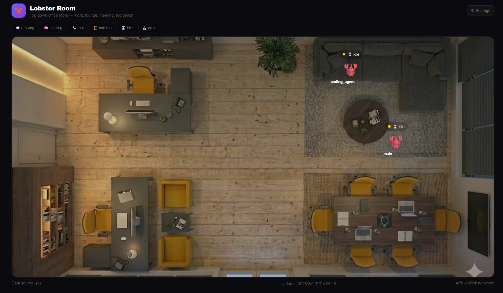

# Lobster Room 🦞

A “Lobster Room” dashboard that visualizes OpenClaw **resident agents** as lobsters
in a bird’s-eye room view, with status bubbles (replying / thinking / tool / idle / error).

This repo is **plugin-only**: Lobster Room is served directly by the OpenClaw
Gateway under `/lobster-room/`.



- Portal: `https://<openclaw-host>/lobster-room/`
- API: `https://<openclaw-host>/lobster-room/api/lobster-room`

## Install / Update

### 0) Security + exposure notes (please read)

- This is an **OpenClaw Gateway plugin**. Anyone who can access your OpenClaw HTTP endpoint can potentially access this dashboard/API.
- **Do not expose OpenClaw (and thus `/lobster-room/`) to the public internet** without an auth layer (VPN / reverse proxy auth / private network).
- Prefer **pinned versions** (a release tag like `v0.1.0`) instead of installing from `main`.

### 1) Ensure the plugin is enabled

In `~/.openclaw/openclaw.json`, enable the plugin:

```json
{
  "plugins": {
    "entries": {
      "lobster-room": { "enabled": true }
    }
  }
}
```

### 2) Install (recommended: pin a release tag)

```bash
VERSION=v0.1.0 bash -c "$(curl -fsSL https://raw.githubusercontent.com/zacmoltbot/lobster-room/main/plugin/lobster-room/install.sh)"
```

### 3) Install (latest release)

```bash
bash -c "$(curl -fsSL https://raw.githubusercontent.com/zacmoltbot/lobster-room/main/plugin/lobster-room/install.sh)"
```

The installer:
- Installs into `~/.openclaw/extensions/lobster-room/`
- Copies the portal HTML to `~/.openclaw/extensions/lobster-room/assets/lobster-room.html`
- Seeds a **Default room** (background + manual walkable map) so the UI is usable immediately
- Attempts `openclaw gateway restart` (best-effort)

If restart fails (common in hosted containers without systemd), restart the **Gateway service/container** manually.

### 4) Install via “OpenClaw prompt” (copy/paste)

Give your OpenClaw agent the following instruction:

> Install the `zacmoltbot/lobster-room` OpenClaw plugin **pinned to VERSION=v0.1.0** by running the official installer script from the repo.
> 
> Steps:
> 1) Ensure `~/.openclaw/openclaw.json` enables plugin id `lobster-room`.
> 2) Download and run: `VERSION=v0.1.0 bash -c "$(curl -fsSL https://raw.githubusercontent.com/zacmoltbot/lobster-room/main/plugin/lobster-room/install.sh)"`.
> 3) Restart the OpenClaw Gateway (if the script cannot restart it, tell me what to restart).
> 4) After install, verify `https://<openclaw-host>/lobster-room/` and report what version was installed.

## Verify

- `https://<openclaw-host>/lobster-room/`
- `https://<openclaw-host>/lobster-room/api/lobster-room`

If you see the OpenClaw Control UI instead of Lobster Room, the plugin is not loaded/enabled.

### Important: updates require a Gateway restart

This is an OpenClaw **plugin**. After updating, you must restart/redeploy the OpenClaw Gateway so it reloads plugin assets. A browser refresh (even incognito) cannot pick up a new build unless the server is updated.

### UI version stamp

Open the Move Debug panel (Settings → *Show Move Debug panel*) and check the `ui=<hash>` stamp. It’s the fastest way to confirm which frontend build is being served.

## How status works (truth + evidence)

This project monitors OpenClaw **in-process** via plugin lifecycle hooks.

- `thinking` comes from: `before_agent_start`
- `tool` comes from: `before_tool_call` (with `toolName`)
- Tool completion is inferred from: `tool_result_persist` and/or `after_tool_call`
- `idle` is entered after a short cooldown, and watchdogs prevent “stuck” states

### Replying

`replying` is driven by outbound message hooks (`message_sending` / `message_sent`) **when available**.

Some OpenClaw builds/environments may not emit these hooks; in that case we fall back to a **synthetic** `replying` blip on successful `agent_end` so the UI matches user-perceived behavior.

Privacy note: by default we **do not** store outbound message previews in debug traces. If you really need that for debugging, set plugin config `debugCaptureMessagePreview=true`.

## Settings (features)

Lobster Room ships with a small Settings UI so you can tweak behavior without redeploying.

### Agent names (agentId → display name)

- Edit in Settings → **Agent names**
- Stored server-side (not just localStorage)

### Rooms (background + manual walkable map)

- Settings → **Room**
- Create/switch rooms
- Upload a background image
- Reset back to Default room

### Manual map editor

- Settings → **Room** → open the editor
- Paint/erase the walkable area used for roaming
- Includes a **Validate map** action (useful to spot disconnected islands)

### HUD / debug

- **Move Debug panel** (HUD + log) for screenshots and collaboration
- Options like **Freeze roaming** (only move on zone change)
- Optional overlays/debug toggles

### Background opacity

- Slider to adjust background visibility

## Debug

### Move Debug panel

The Move Debug panel is **hidden by default**. Enable it in Settings when needed.

### Activity traces

The backend exposes a small ring buffer of recent events per agent in:

- `agents[].debug.decision.recentEvents[]`

Each entry includes:

- `ts` (ms timestamp)
- `kind` (hook name)
- `agentId` (derived from `sessionKey` when available)
- `data` (best-effort; e.g. `toolName`, and for `exec` we include the command)

### After uploading a new room background

After a successful upload, Settings stays open and the UI prompts you to paint the manual walkable map for the new room.

## License / Attribution

- Original project: `mudrii/openclaw-dashboard` (MIT License)
- This fork: still MIT (see `LICENSE`)
